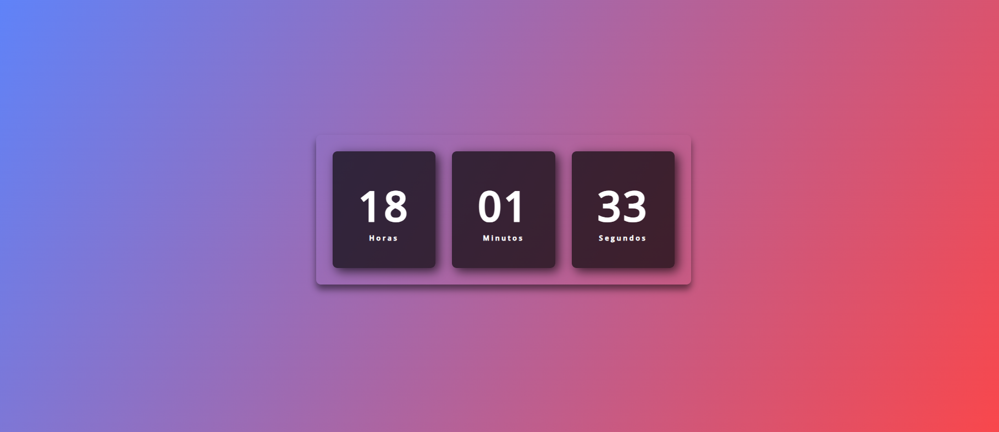

## Relógio digital dinâmico
### 🌐 Fonte
Video [Relógio Digital DINÂMICO | HTML, CSS e JS.](https://youtu.be/GK0ok3ZCXwM?si=wLNx2f86HPHasgU6) da Larissa Kich
### 📸 Screenshot

### 🛠️ Tecnologias ultilizadas


### 🧠 O que aprendi 
Aprendi a usar:
- ```dateToday.getHours()```
- ```dateToday.getMinutes()```
- ```dateToday.getSeconds()```
- ```.textContent```